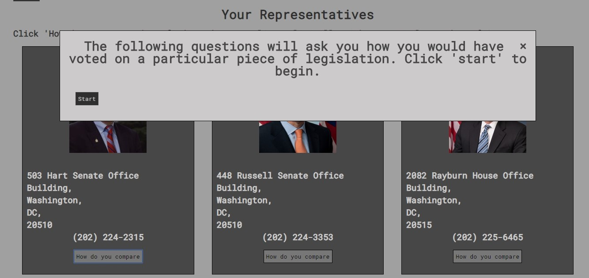

**Voting Made Simple**

Voting Made Simple is an app that allows the user to make informed decisions regarding their elected representatives.

Initially the user is directed to enter their address in order to search for the members of Congress that represent them.

      
      
After entering their address the user is presented with their two Senators and their member of the House of Representatives.

      
      
If the user clicks 'how do you compare' a modal opens directing them to take a short quiz.

      
      
The quiz questions are generated from recent pieces of legislation that have been voted on in Congress.

      
      
If the user needs more information about a particular piece of legislation, they are directed to the appropriate government website where they can conduct more research.

      
      
After completing the quiz, the users answers are compared with how their representative actually voted on those pieces of legislation and a percentage match is returned.

      
      
The quiz can be repeated for each representative. After each quiz, the percentage match is displayed under the representative.

      
      
**Built with:** html, css, javascript.

